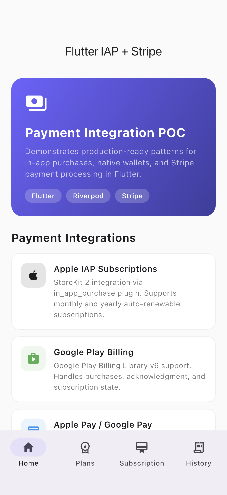
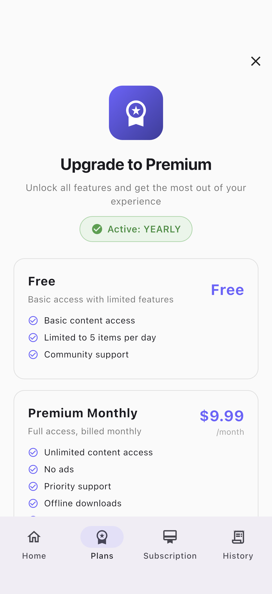
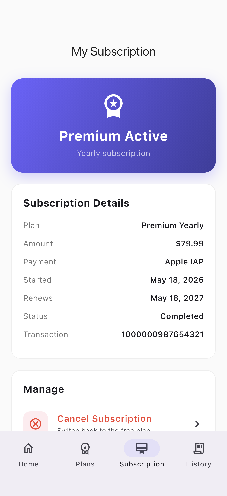
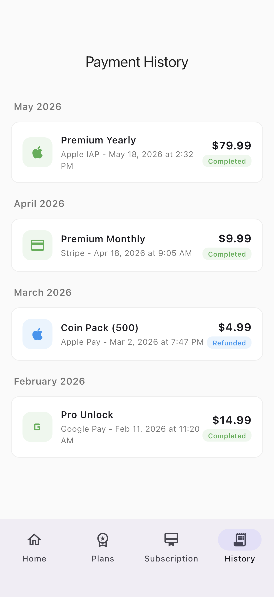
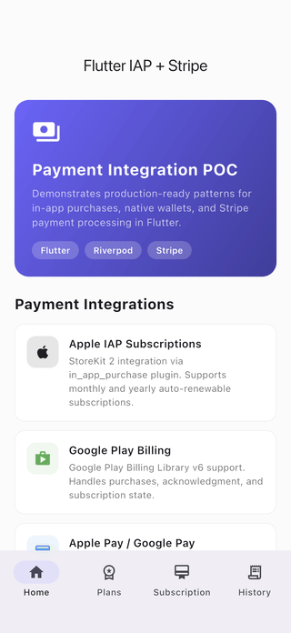

# flutter_iap_stripe

A Flutter POC demonstrating production-ready payment integration: Apple IAP and Google Play Billing subscriptions, native Apple Pay / Google Pay wallets, and Stripe checkout, with receipt validation, purchase restoration, subscription management, and payment history. State is managed with Riverpod.

## Demo

These are real screenshots captured from the running app on the iOS Simulator (not mockups). See [FLOW.md](FLOW.md) for exactly how they were generated.

| Home | Plans | Subscription | History |
| --- | --- | --- | --- |
|  |  |  |  |

## Features

- Apple IAP subscriptions via StoreKit 2 (`in_app_purchase`), monthly and yearly auto-renewable plans
- Google Play Billing support (purchases, acknowledgment, subscription state)
- Native Apple Pay / Google Pay one-tap checkout (`pay`)
- Stripe PaymentSheet and custom card entry, server-side PaymentIntent flow (`flutter_stripe`)
- Receipt validation and purchase restoration
- Subscription management (upgrade, downgrade, cancel)
- Payment history grouped by month with transaction detail sheets
- Riverpod state management, multi-platform support

## Stack

- Flutter + Dart
- Riverpod (state management)
- in_app_purchase, pay, flutter_stripe
- shared_preferences (local subscription/history store)
- intl (date and price formatting)
